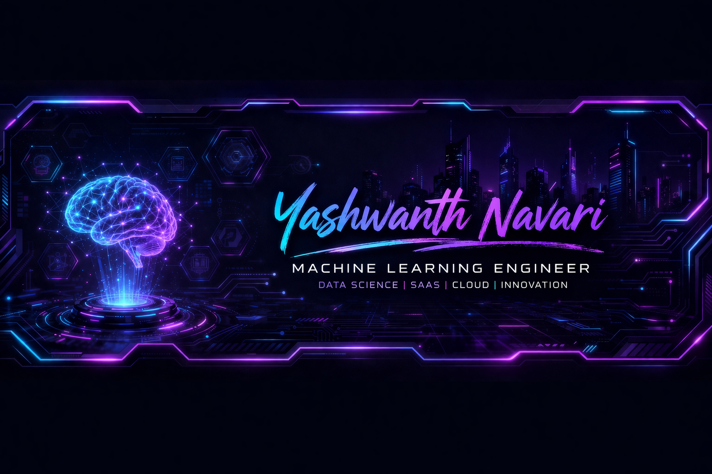

<p align="center">
  
</p>


<p align="center">
  
</p>

<p align="center">
  
  
  
</p>


<p align="center">
  
</p>

<p align="center">
  
  
  
</p>

---

# 👋 Welcome to my GitHub Space

I’m **Yashwanth Navari**, a **B.Tech Data Science student at Woxsen University** focused on building technology that solves practical problems.

My work combines:

- 🧠 machine learning
- 📊 data-driven systems
- ☁️ cloud-ready products
- 🌐 web applications
- 🚀 deployable SaaS solutions

I enjoy turning ideas into **working systems that people can actually use**.

---

# 🚀 What Drives Me

I love working on projects where **data meets product design**.

Whether it’s:
- prediction systems
- computer vision
- automation platforms
- smart analytics tools

my focus is always on **building something useful and scalable**.

---

# 💻 Current Tech Focus

### 🤖 Artificial Intelligence
- Machine Learning
- Deep Learning
- Computer Vision
- Model Optimization
- Feature Engineering

### 📊 Data Science
- Data preprocessing
- Exploratory analysis
- predictive modeling
- evaluation metrics
- analytics pipelines

### ☁️ Cloud + Product
- AWS basics
- Azure ecosystem
- SaaS architecture
- deployment workflows
- scalable application thinking

---

# 🛠️ Tools I Work With

<p>
  
  
  
  
  
  
  
  
  
</p>

---

# 🌟 Projects I’m Proud Of

## 🌾 AgriSathi
Smart agriculture assistant using ML insights and decision support.

## 📄 Resume Generator
A resume SaaS tool with professional templates and export support.

## 🤖 Age & Gender Detection
Computer vision based real-time intelligent detection project.

## ❤️ Organ Donation Platform
A system focused on healthcare matching and structured workflows.

## 🚌 Shuttle Routing
Optimization logic for route efficiency and scheduling.

---

# 📈 GitHub Snapshot

<p align="center">
  
  
</p>

<p align="center">
  
</p>

---

# 🎯 What I’m Working Toward

- building production-ready ML systems
- mastering cloud deployment
- stronger software engineering practices
- landing impactful internships
- creating startup-ready SaaS products

---

# 🌐 Reach Me

<p>
  <a href="https://www.linkedin.com/in/navari-yashwanth-reddy-4a7065357/">
    
  </a>

  <a href="https://www.hackerrank.com/profile/ekomotsu">
    
  </a>

  <a href="https://github.com/YashwanthNavari">
    
  </a>
</p>

---

⭐ *Always building. Always improving. Always learning.*
```
