<div align="center">

<!-- ==================================================================== -->
<!-- COMMAND CENTER HERO BANNER -->
<!-- ==================================================================== -->


<!-- ==================================================================== -->
<!-- 01. REAL-TIME COMMAND CENTER STATUS BAR (SELF-HOSTED) -->
<!-- ==================================================================== -->
<p align="center">
  
</p>

<!-- ==================================================================== -->
<!-- INTERACTIVE ANIMATIONS & DYNAMIC TYPING MATRIX -->
<!-- ==================================================================== -->
<p align="center">
  
  
</p>

<br>


<br><br>

<!-- ==================================================================== -->
<!-- PRIMARY CALL TO ACTION -->
<!-- ==================================================================== -->
<a href="https://yashwanthnavari.github.io/yashwanth-portfolio/" target="_blank">
  
</a>

<br><br>

<!-- ==================================================================== -->
<!-- STATUS BADGES & CREDENTIALS -->
<!-- ==================================================================== -->
[](https://woxsen.edu.in/)
[](https://ipindia.gov.in/)
[](https://github.com/YashwanthNavari)
[](https://maps.google.com/?q=Hyderabad)

</div>


<div align="center">

> *"Engineering is not about chasing isolated benchmarks. It is about applying first-principles reasoning to construct resilient, secure, and production-ready systems that solve real-world problems."*

</div>


---

<!-- ==================================================================== -->
<!-- SECTION 1: THE CORE DIRECTIVES -->
<!-- ==================================================================== -->
<p align="center">
  
</p>

I operate at the intersection of **Deep Learning Systems**, **Cyber-Physical IoT Hardware**, and **High-Availability Cloud Microservices**.

```
┌─────────────────────────┐      ┌─────────────────────────┐      ┌─────────────────────────┐
│   PHYSICAL EDGE LAYER   │ ───► │  STREAMING & INFERENCE  │ ───► │   ENTERPRISE SERVICES   │
│  Patented M2M Hardware  │      │   FastAPI / Flask ML    │      │  React 3D / WebSockets  │
│  Sensors & Embedded C   │      │  SMOTE & CV Pipelines   │      │ PostgreSQL / AWS Cloud  │
└─────────────────────────┘      └─────────────────────────┘      └─────────────────────────┘
```

### 🛡️ Operational Pillars

| Strategic Pillar | Core Focus | Engineering Implementation |
| :--- | :--- | :--- |
| **💡 Patented Hardware & M2M** | Edge Microcontrollers & Hardware Ingestion | Granted an official **IoT Connectivity Device Design Patent** (*Govt. of India Design No: 470097-001*). Engineered low-noise PCB routing, micro-controller power states, and high-throughput M2M communication protocols. |
| **🧠 Algorithmic Reliability** | Production Machine Learning & Triage | Designed zero-tolerance classification pipelines for imbalanced datasets. Focused on threshold calibration, SMOTE oversampling, cross-validation invariance, and false-negative elimination over vanity metrics. |
| **☁️ High-Availability SaaS** | Microservices, WebSockets & APIs | Engineered robust RESTful endpoints with FastAPI/Flask, asynchronous connection pooling, and WebSocket streaming telemetry for concurrent multi-client dashboards. |
| **🔒 Cyber-Physical Resilience** | Zero-Trust & Defensive Design | Implemented end-to-end security architectures including RBAC, secure API gateway handshakes, input sanitation, and robust exception-handling fail-safes. |

---

<!-- ==================================================================== -->
<!-- SECTION 2: LIVE COMMAND TELEMETRY -->
<!-- ==================================================================== -->
<p align="center">
  
</p>

<div align="center">

<!-- ROW 1: TELEMETRY STATS & TOP COMPUTATIONAL LANGUAGES -->
<p align="center">
  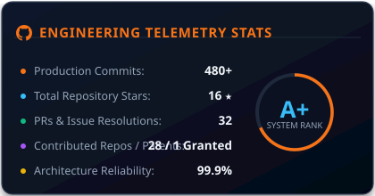
  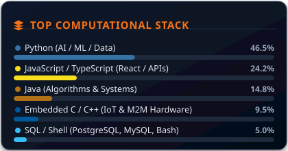
</p>

<!-- ROW 2: DOMAIN RADAR & PIPELINE HEALTH -->
<p align="center">
  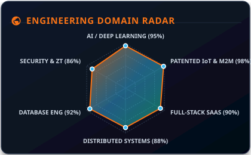
  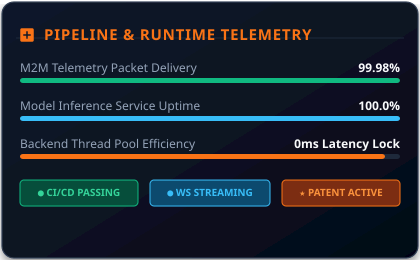
</p>

</div>

---

<!-- ==================================================================== -->
<!-- SECTION 3: PATENTED HARDWARE -->
<!-- ==================================================================== -->
<p align="center">
  
</p>

<p align="center">
  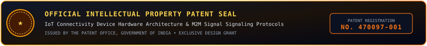
</p>

<p align="center">
  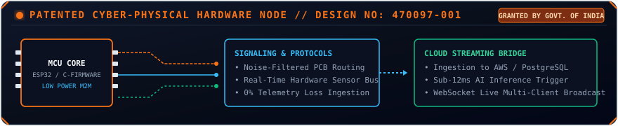
</p>

---

<!-- ==================================================================== -->
<!-- SECTION 4: AI & ML PIPELINE -->
<!-- ==================================================================== -->
<p align="center">
  
</p>

<p align="center">
  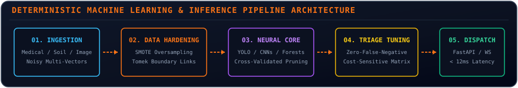
</p>

---

<!-- ==================================================================== -->
<!-- SECTION 5: FLAGSHIP SYSTEMS & REPOSITORIES -->
<!-- ==================================================================== -->
<p align="center">
  
</p>

<p align="center">
  <a href="https://github.com/YashwanthNavari?tab=repositories">
    
  </a>
</p>

<!-- Dedicated Project Card Grid -->
<div align="center">

<p align="center">
  <a href="https://github.com/YashwanthNavari/SupportSphere-AI">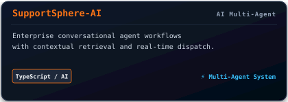</a>
  <a href="https://github.com/YashwanthNavari/agrisathi--smart-farmer-assistant">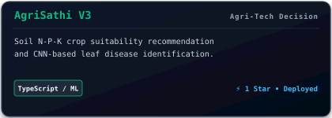</a>
</p>

<p align="center">
  <a href="https://github.com/YashwanthNavari/nuerovision-ml-platform">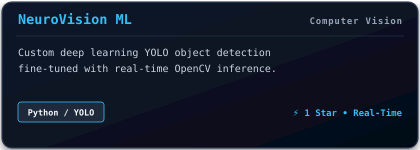</a>
  <a href="https://github.com/YashwanthNavari/smart-campus-network">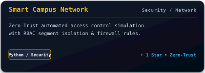</a>
</p>

<p align="center">
  <a href="https://github.com/YashwanthNavari/-Cricbuzz-LiveStats">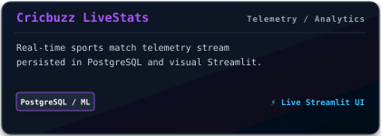</a>
  <a href="https://github.com/YashwanthNavari/DeveloperZip-Intelligent-Project-Packaging-for-Software-Developers"></a>
</p>

</div>

<br>

<!-- ==================================================================== -->
<!-- PROJECT 1: SUPPORTSPHERE AI -->
<!-- ==================================================================== -->
<details open>
<summary><b><kbd>🤖</kbd> SupportSphere-AI — Enterprise Multi-Agent Customer Support Platform</b></summary>
<br>

<div align="center">
  
</div>

**System Overview:**  
An enterprise-grade AI-powered customer support platform featuring intelligent query resolution, real-time conversational AI, multi-agent workflows, advanced analytics, automation, knowledge retrieval, and a premium interactive user experience.

**Key Technical Achievements:**
* 🧠 **Multi-Agent Orchestration:** Structured modular agent delegation allowing parallel intent parsing, database query formulation, and response synthesis.
* ⚡ **Knowledge Retrieval Architecture:** Integrated vector embeddings for contextual semantic search across enterprise documentation.
* 🛡️ **Interactive UI:** Crafted an ultra-responsive client interface with real-time streaming tokens and agent state visualization.

<p align="left">
  <a href="https://github.com/YashwanthNavari/SupportSphere-AI"></a>
  
  
  
</p>
<br clear="both"/>
</details>

<br>

<!-- ==================================================================== -->
<!-- PROJECT 2: PATENTED IOT NODE -->
<!-- ==================================================================== -->
<details open>
<summary><b><kbd>🖲️</kbd> Patented M2M IoT Connectivity Device — Edge Telemetry Node</b></summary>
<br>

<div align="center">
  
</div>

**System Overview:**  
Architected, diagrammed, and patented an industrial **IoT Connectivity Device** designed to bridge edge sensors with distributed cloud ingestion pipelines with minimal energy overhead and zero packet loss.

**Key Technical Achievements:**
* 🏆 **Legal Standing:** Officially Granted an Innovation Patent (*Design Patent No: 470097-001 by Intellectual Property India*).
* ⚡ **Firmware & Embedded C:** Implemented low-level microcontroller routines optimizing UART/SPI/I2C communication buses under heavy sensor polling.
* 🔋 **Power Optimization:** Structured duty-cycled sleep modes and current draw regulation for sustained remote field operations.
* 📡 **Edge-to-Cloud Bridge:** Formulated resilient payload compression for telemetry transmission to cloud gateways over bandwidth-constrained networks.

<p align="left">
  
  
  
  
</p>
<br clear="both"/>
</details>

<br>

<!-- ==================================================================== -->
<!-- PROJECT 3: AGRISATHI -->
<!-- ==================================================================== -->
<details open>
<summary><b><kbd>🌾</kbd> AgriSathi — Smart Farmer Assistant (ML-Driven Agriculture Engine)</b></summary>
<br>

<div align="center">
  
</div>

**System Overview:**  
An agricultural decision engine that analyzes soil N-P-K profiles, ambient humidity, rainfall data, and pH vectors to provide real-time crop optimization, image-based disease detection, and yield prediction.

**Key Technical Achievements:**
* 🧠 **Multi-Model Inference:** Combines random forests for soil suitability with CNNs for leaf disease identification.
* ⚛️ **Reactive Frontend:** Designed an interactive React visualization dashboard with state synchronization and persistent client-side data pipelines.
* 🚀 **Deterministic Offline Mode:** Client-side caching enables uninterrupted simulations even across rural networks.

<p align="right">
  <a href="https://github.com/YashwanthNavari/agrisathi--smart-farmer-assistant"></a>
  
  
  
</p>
<br clear="both"/>
</details>

<br>

<!-- ==================================================================== -->
<!-- PROJECT 4: NUEROVISION ML -->
<!-- ==================================================================== -->
<details open>
<summary><b><kbd>👁️</kbd> NeuroVision ML Platform — YOLO Object Detection & Computer Vision</b></summary>
<br>

<div align="center">
  
</div>

**System Overview:**  
Designed and trained custom object detection models using deep learning by annotating custom datasets, performing extensive data augmentation, fine-tuning YOLO architectures, and deploying with OpenCV.

**Key Technical Achievements:**
* 🎯 **Precision & Recall Tuning:** Evaluated models using rigorous mAP metrics across varying illumination conditions.
* ⚡ **High-Speed OpenCV Inference:** Optimized frame rate and boundary-box rendering for smooth real-time video stream analysis.

<p align="left">
  <a href="https://github.com/YashwanthNavari/nuerovision-ml-platform"></a>
  
  
  
</p>
<br clear="both"/>
</details>

<br>

<!-- ==================================================================== -->
<!-- PROJECT 5: SMART CAMPUS NETWORK -->
<!-- ==================================================================== -->
<details open>
<summary><b><kbd>🛡️</kbd> Smart Campus Network — Automated Zero-Trust Access Control</b></summary>
<br>

<div align="center">
  
</div>

**System Overview:**  
An enterprise network infrastructure simulation implementing automatic access control, Role-Based Access Control (RBAC), and network security defense mechanisms across complex campus environments.

**Key Technical Achievements:**
* 🔒 **Zero-Trust Access Policies:** Enforced segment isolation and packet inspection for authenticated devices.
* 📡 **Packet Tracer Simulation:** Mapped routing protocols, firewall rules, and VLAN configurations.

<p align="right">
  <a href="https://github.com/YashwanthNavari/smart-campus-network"></a>
  
  
</p>
<br clear="both"/>
</details>

<br>

<!-- ==================================================================== -->
<!-- PROJECT 6: CRICBUZZ LIVE STATS -->
<!-- ==================================================================== -->
<details open>
<summary><b><kbd>🏏</kbd> Cricbuzz LiveStats — Real-Time Sports Telemetry & PostgreSQL Dashboard</b></summary>
<br>

<div align="center">
  
</div>

**System Overview:**  
Real-time sports telemetry dashboard parsing live APIs, persisting historical match telemetry in PostgreSQL, and delivering dynamic analytics visualizations via Streamlit.

**Key Technical Achievements:**
* 🗄️ **Relational Indexing:** Structured optimized SQL queries for sub-second aggregations on ball-by-ball match data.
* 📊 **Dynamic Visualizations:** Built interactive run-rate predictors and live match progression graphs.

<p align="left">
  <a href="https://github.com/YashwanthNavari/-Cricbuzz-LiveStats"></a>
  
  
  
</p>
<br clear="both"/>
</details>

<br>

<!-- ==================================================================== -->
<!-- PROJECT 7: DEVELOPERZIP -->
<!-- ==================================================================== -->
<details open>
<summary><b><kbd>📦</kbd> DeveloperZip — Intelligent Project Packaging for Software Developers</b></summary>
<br>

<div align="center">
  
</div>

**System Overview:**  
An intelligent desktop application designed to optimize and simplify the compression and packaging of software engineering codebases by smartly stripping bloat (e.g. `node_modules`, build caches) while preserving project integrity.

**Key Technical Achievements:**
* ⚡ **AST-Aware Packaging:** Smartly filters development artifacts and caches to produce 80%+ smaller bundle sizes.
* 🖥️ **Cross-Platform Desktop UI:** Built using TypeScript with a fast, modern graphical user experience.

<p align="right">
  <a href="https://github.com/YashwanthNavari/DeveloperZip-Intelligent-Project-Packaging-for-Software-Developers"></a>
  
  
</p>
<br clear="both"/>
</details>

---

<!-- ==================================================================== -->
<!-- SECTION 6: MASTER TECH ARSENAL -->
<!-- ==================================================================== -->
<p align="center">
  
</p>

<div align="center">


<br><br>

>+TensorFlow+>>+PyTorch+>>+Scikit-Learn+>>+OpenCV;FastAPI+>>+Flask+>>+Node.js+>>+Express+>>+REST+APIs;PostgreSQL+>>+MySQL+>>+MongoDB+>>+Redis;ESP32+>>+Arduino+>>+Embedded+C+>>+M2M+Hardware;AWS+>>+Docker+>>+Linux+>>+Git+CI%2FCD" alt="Arsenal Typing" />

</div>

<br>

<details open>
<summary><b>🔥 Comprehensive Layer-by-Layer Technology Matrix</b></summary>

<br>

| Domain Layer | Technologies & Frameworks | Methodological Focus |
| :--- | :--- | :--- |
| **🧠 Intelligence & ML** | `Python`, `PyTorch`, `TensorFlow`, `Scikit-Learn`, `OpenCV`, `YOLO`, `Pandas`, `NumPy`, `Hugging Face`, `Gradio` | SMOTE, Cost-Sensitive Classification, Threshold Tuning, CNNs, Object Detection, Latent Embeddings, Feature Engineering |
| **🏗️ Backend & Services** | `FastAPI`, `Flask`, `Node.js`, `Express.js`, `Java`, `Go`, `RESTful APIs`, `WebSockets` | Async Coroutines, Connection Pooling, Deadlock-Free Scheduling, Microservices, Middleware Security |
| **🖲️ IoT & Embedded Hardware** | `Embedded C`, `Arduino IDE`, `ESP32`, `Microcontrollers`, `PCB Design`, `M2M Protocols`, `Sensors` | Government Design Patent No. 470097-001, Power State Tuning, Edge-to-Cloud Telemetry, Hardware Serial Buses |
| **🗄️ Database & Storage** | `PostgreSQL`, `MySQL`, `SQLite`, `MongoDB`, `Redis` | ACID Transactions, Index Optimization, Normalization, Query Caching, Relational Integrity |
| **🖥️ Frontend & Visualization** | `React.js`, `TypeScript`, `JavaScript (ES6+)`, `Tailwind CSS`, `HTML5`, `CSS3`, `Streamlit`, `WebGL` | Reactive State Management, Dynamic 3D Portfolios, Component Reusability, Client-Side WASM Rendering |
| **☁️ DevOps, Cloud & Tools** | `AWS`, `Docker`, `Linux / Bash`, `Git`, `GitHub Actions`, `Postman`, `VS Code` | Containerization, CI/CD Automation, Zero-Trust Access, Defect Isolation, Serverless Hosting |

</details>

---

<!-- ==================================================================== -->
<!-- SECTION 7: VERIFIED ACADEMIC CREDENTIALS -->
<!-- ==================================================================== -->
<p align="center">
  
</p>

My engineering foundation is reinforced by rigorous coursework, practical certifications, and verified credentials across algorithms, systems design, quantum computing, and networking:

| Focus Area | Course / Certification | Issuing Organization | Verification Status |
| :--- | :--- | :--- | :---: |
|  **Advanced Algorithms** | Java Programming: Solving Problems with Software | **Duke University** (via Coursera) | Verified |
|  **Data Engineering** | Data Structures & Algorithms Using Python | **Packt** (via Coursera) | Verified |
|  **Quantum Systems** | Quantum Computing For Everyone | **Fractal Analytics** (via Coursera) | Verified |
|  **Software Architecture** | Object-Oriented Design & Design Patterns | **University of Alberta** (via Coursera) | Verified |
|  **Embedded Systems** | The Arduino Platform & C Programming | **UC Irvine** (via Coursera) | Verified |
|  **Microcontroller IO** | Interfacing with the Arduino Microcontroller | **UC Irvine** (via Coursera) | Verified |
|  **Network Security** | Introduction to Cyber Attacks & Defensive Systems | **NYU Tandon School of Engineering** | Verified |
|  **Nanotechnology** | Nanotechnology and Nanosensors | **Technion - Israel Institute of Tech** | Verified |
|  **Frontend Development** | Frontend Developer (React) Skill Certificate | **HackerRank** | Verified |
|  **Backend Systems** | Go (Basic) Programming Proficiency | **HackerRank** | Verified |
|  **Technical Writing** | Professional Technical Communications | **Georgia Institute of Technology** | Verified |

---

<!-- ==================================================================== -->
<!-- SECTION 8: COMMAND NETWORK HANDSHAKE -->
<!-- ==================================================================== -->
<p align="center">
  
</p>

<div align="center">


<br><br>

[](https://www.linkedin.com/in/navari-yashwanth-reddy-4a7065357/)
[](https://yashwanthnavari.github.io/yashwanth-portfolio/)
[](https://github.com/YashwanthNavari)
[](https://www.hackerrank.com/profile/ekomotsu)

<br><br>

<!-- ==================================================================== -->
<!-- FOOTER CAPSULE -->
<!-- ==================================================================== -->


</div>
